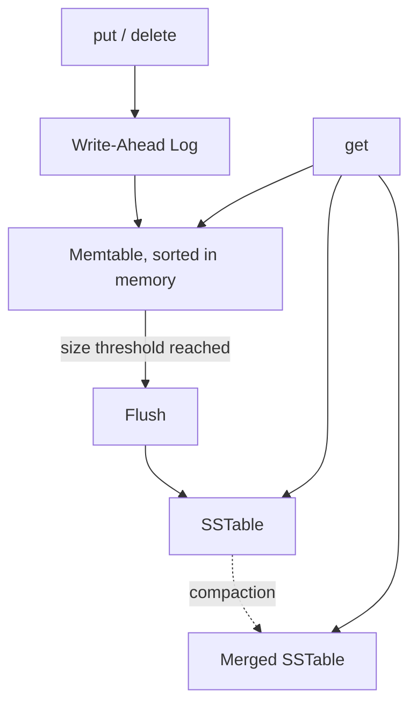

# LSM-Storage-Engine

[](https://github.com/sfeirc/LSM-Storage-Engine/actions/workflows/ci.yml)
[](https://www.rust-lang.org/)
[](LICENSE)

A from-scratch **Log-Structured Merge-Tree** key-value store — the write-optimized architecture behind RocksDB, Cassandra, and LevelDB — in Rust: memtable, write-ahead log, SSTables with sparse indexes, bloom filters, and compaction, with tests that prove durability and correctness rather than just exercise the happy path.

## Why an LSM-Tree

A B-Tree updates data in place, which means random disk I/O on every write. An LSM-Tree instead buffers writes in memory and flushes them sequentially to disk as immutable sorted files, turning random writes into sequential ones — the standard tradeoff write-heavy databases make, at the cost of reads needing to check multiple places and periodic compaction to reclaim space.

### Why this matters across industries

An LSM-Tree isn't a niche academic structure — it's the storage engine underneath RocksDB, Cassandra, and LevelDB, chosen specifically because turning random writes into sequential ones matters wherever write volume, not read volume, is the bottleneck. That's a genuinely cross-industry constraint. Time-series and telemetry ingestion in industrial/IoT settings — a sensor network or a fleet of controllers producing a continuous stream of small writes — is exactly this workload. So is trade and tick storage in finance, where every price update or order event has to be durably persisted at high, bursty write rates without falling behind. And it's a routine backend-infrastructure need any time an application logs, event-sources, or timestamps more than it reads back arbitrary keys. This repository doesn't claim to be production-ready for any of those workloads — see "Honest scope" below for exactly what's missing — but the memtable/WAL/SSTable/compaction pipeline it implements from scratch is the same shape of pipeline those production systems run, and the benchmarks further down measure its actual write/read/durability tradeoffs rather than asserting them.



## Components (`src/`)

- **`memtable.rs`** — sorted in-memory buffer for recent writes (including tombstones for deletes).
- **`wal.rs`** — every write is appended to the write-ahead log *before* touching the memtable, so a crash before the next flush doesn't lose confirmed writes. Handles a torn/partial tail record (from a crash mid-write) by discarding it rather than erroring.
- **`sstable.rs`** — immutable sorted on-disk file with a sparse index (one (key, offset) entry every N records) so a lookup doesn't need to scan the whole file.
- **`bloom.rs`** — a bloom filter per SSTable to skip disk I/O for keys that are definitely absent.
- **`compaction.rs`** — merges multiple SSTables into one, resolving duplicate keys (newest wins) and physically dropping tombstones.
- **`lsm.rs`** — ties it together: `get`/`put`/`delete`, auto-flush past a size threshold, auto-compaction past a table-count threshold, and reopening an existing directory (WAL replay + loading existing SSTables).

## Verified correctness

- **Read-after-write consistency across every state**: a key just written (still in the memtable), just flushed (now in an SSTable), and after compaction all return the correct value — `tests/read_after_write.rs`.
- **Real crash recovery, not simulated**: `tests/crash_recovery.rs` spawns a real child process (`src/bin/crash_worker.rs`) that writes data and then is **actually SIGKILLed** mid-run (no graceful shutdown, no clean flush) — the test then reopens the directory and verifies every write that was confirmed before the kill is recovered via WAL replay, with no duplicates. A second test confirms this holds even mid-compaction.
- **Tombstones are physically removed, not just masked**: `tests/tombstone.rs` proves a deleted key never reappears across several more compaction cycles, and that the delete marker itself is gone from disk after compaction (not merely shadowed).
- **Correctness against a reference model**: `tests/oracle_model.rs` runs a long randomized sequence of put/get/delete operations against both the real engine (through flushes and compactions) and a plain `HashMap` oracle, asserting every `get` matches — the strongest correctness test in the repo, because it doesn't rely on anyone having thought of the right edge case in advance.
- **38 tests total** (26 unit + 12 integration/crash/oracle), all passing.

## Benchmarks

Measured on this repo's own dev machine (shared 4-core Xeon E5-2683 v3 VM; Criterion, `cargo bench`):

| Benchmark | Result |
|---|---|
| Write 2000 entries, WAL fsync **on** every write | **~9.66 s** |
| Write 2000 entries, WAL fsync **off** | **~9.86 ms** (~980x faster) |
| Read a **missing** key, bloom filter **on** | **3.13 µs** |
| Read a **missing** key, bloom filter **off** | **318.93 µs** (~100x slower) |
| Read a **present** key, bloom filter on vs. off | 81.84 µs vs. 82.36 µs (no measurable difference) |
| Compact 2000 entries across SSTables | ~18.3 ms |

Three honest notes on these numbers:
1. The fsync gap is unusually large — likely specific to this VM's virtualized disk (cloud/VM storage often has much higher fsync latency than local NVMe). The *direction* and *existence* of the tradeoff (durability costs throughput) is the real lesson; the exact multiplier will vary by hardware.
2. The bloom filter benchmark is exactly what it should be: a large win on absent-key lookups (the case it exists for) and no measurable cost on present-key lookups (it's just one more cheap check before work that was happening anyway).
3. **Not measured**: compaction at 10,000 entries — Criterion's own auto-estimate projected ~11 minutes for that one data point on this shared VM, which wasn't a good use of time for a single additional sample; the 2,000-entry number above is real and reproducible, the larger size just wasn't run to completion. Reproduce with `cargo bench --bench lsm_bench`.

## Try it

```bash
cargo build --release
./target/release/lsm-cli               # runs a small demo in a temp dir
./target/release/lsm-cli ./my-data-dir # persists to a real directory you can reopen
```

Or with Docker:

```bash
docker build -t lsm-storage-engine .
docker run --rm lsm-storage-engine
```

## Honest scope — what this is *not*

- **Single-threaded.** No concurrent writers, no lock-free structures — this is the storage algorithm, not a concurrent database engine.
- **One compaction strategy** (merge-all), not leveled/tiered compaction as in production LSM engines.
- **No corruption checksums** beyond WAL torn-tail detection — an SSTable with bit-flipped bytes in the middle wouldn't be caught.
- **No network/distribution** — this is the single-node storage layer, not a distributed database.

## License

MIT — see [LICENSE](LICENSE).
